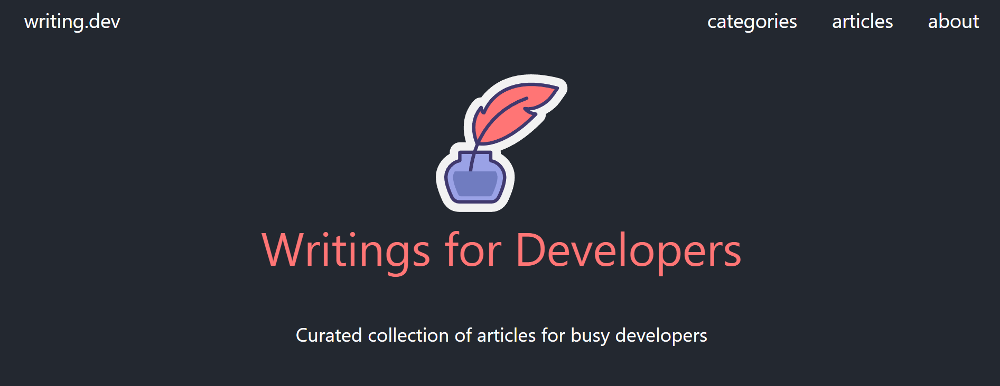
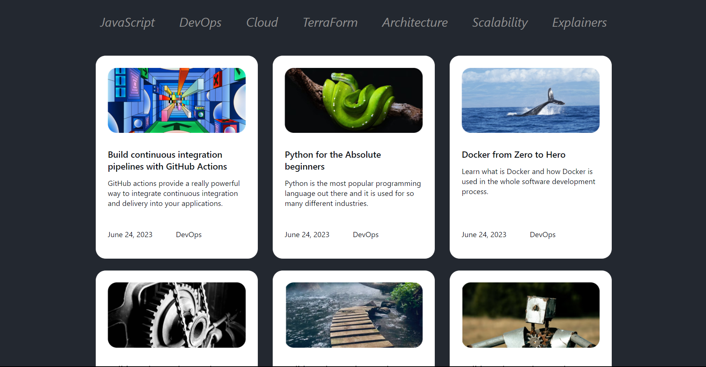
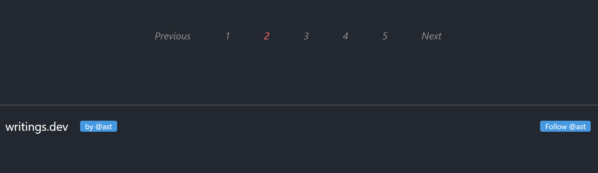

# Basic-Blog-Website-using-HTML-CSS

## Introduction
This is a responsive website made in HTML, CSS, and Bootstrap framework.

## What does this look like?
There are some demos of the website: 
* The tab website:      
  

* The header website: 

* The body website:

* The footer website:

## To see the website fully
You can download all files in this project and open the "index.html" file to see a full website or you can check it [HERE](https://basicblogwebsite.netlify.app/).  
This is a sample website that I only build the interface.

### I took the project idea [HERE](https://www.figma.com/file/nh0V05z3NB87ue9v5PcO3R/writings.dev?node-id=0%3A1&mode=dev).

